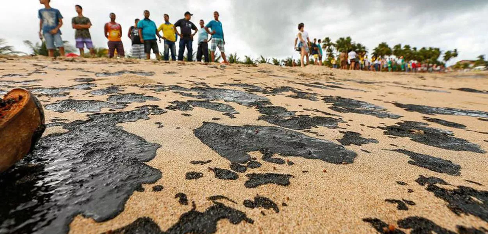

```{r}
#| label: setup
#| include: false

pbev <- readRDS("pbev.rds")

library(tidyverse)
library(patchwork)
library(formattable)
library(gt)
library(gtExtras)
library(ggridges)
library(wesanderson)
library(ggiraph)   

theme_set(
  theme_ridges() +
    theme(legend.position = "right")
)

cats <- sort(unique(pbev$categoria))
minhas_cores <- wes_palette("Darjeeling2", n = length(cats), type = "continuous")
names(minhas_cores) <- cats

options(
  ggplot2.discrete.fill   = unname(minhas_cores),
  ggplot2.discrete.colour = unname(minhas_cores)
)  

pbev <- readRDS("pbev.rds") |>
  filter(emissao_gasolina_diesel_co2_total_g_km < 1000)

emissao_anual <- pbev |>
  group_by(categoria) |>
  summarise(
    Etanol                    = mean(emissao_etanol_co2_total_g_km, na.rm = TRUE) * 13000 / 1000,
    Etanol_Fossil             = mean(emissao_etanol_co2_fossil_total_g_km, na.rm = TRUE) * 13000 / 1000,
    Gasolina_ou_Diesel        = mean(emissao_gasolina_diesel_co2_total_g_km, na.rm = TRUE) * 13000 / 1000,
    Gasolina_ou_Diesel_Fossil = mean(emissao_gasolina_diesel_co2_fossil_total_g_km, na.rm = TRUE) * 13000 / 1000
  ) |>
  mutate(CO2_Evitado_Usando_Etanol = Gasolina_ou_Diesel - Etanol)

pbev <- pbev |>
  filter(emissao_gasolina_diesel_co2_total_g_km < 1000)

resumo <- pbev |>
  group_by(categoria) |>
  summarise(across(
    c(emissao_etanol_co2_total_g_km,
      emissao_gasolina_diesel_co2_total_g_km,
      etanol_km_por_litro_combinado,
      diesel_ou_gasolina_km_por_litro_combinado),
    \(x) mean(x, na.rm = TRUE)
  ))

emissao_anual <- pbev |>
  group_by(categoria) |>
  summarise(
    n = n(),
    Etanol = mean(emissao_etanol_co2_total_g_km, na.rm = TRUE) * 13000 / 1000,
    Etanol_Fossil = mean(emissao_etanol_co2_fossil_total_g_km, na.rm = TRUE) * 13000 / 1000,
    Gasolina_ou_Diesel = mean(emissao_gasolina_diesel_co2_total_g_km, na.rm = TRUE) * 13000 / 1000,
    Gasolina_ou_Diesel_Fossil = mean(emissao_gasolina_diesel_co2_fossil_total_g_km, na.rm = TRUE) * 13000 / 1000
  ) |>
  mutate(
    CO2_Evitado_Usando_Etanol = Gasolina_ou_Diesel - Etanol
  )
emissao_long <- pbev |>
  select(categoria,
         Etanol = emissao_etanol_co2_total_g_km,
         `Gasolina/Diesel` = emissao_gasolina_diesel_co2_total_g_km) |>
  pivot_longer(cols = c(Etanol, `Gasolina/Diesel`),
               names_to = "combustivel", values_to = "emissao") |>
  mutate(combustivel = factor(combustivel, levels = c("Etanol", "Gasolina/Diesel")))

p_base <- ggplot(emissao_long, aes(x = emissao, y = categoria, fill = categoria)) +
  geom_density_ridges(scale = 2.5, rel_min_height = 0.01) +
  facet_wrap(~ combustivel, scales = "free_x") +
  scale_y_discrete(limits = cats, drop = FALSE)

fuels <- c("Etanol", "Gasolina/Diesel")
ridge_geo <- ggplot_build(p_base)$data[[1]] |>
  as_tibble() |>
  filter(height >= min_height) |>
  transmute(
    x, ymin, ymax,
    combustivel = factor(fuels[as.integer(PANEL)], levels = fuels),
    categoria   = factor(cats[group], levels = cats),
    grp         = interaction(PANEL, group, drop = TRUE)
  ) |>
  arrange(combustivel, desc(as.integer(categoria)), x)

resumo_tip <- emissao_long |>
  filter(!is.na(emissao)) |>
  group_by(combustivel, categoria) |>
  summarise(media = mean(emissao), n = n(), .groups = "drop") |>
  mutate(tip = paste0(categoria,
                      "\nMédia: ", round(media, 1), " g/km",
                      "\nn = ", n))


```

## O desafio dos combustíveis fósseis {.smaller}

::::: columns
::: {.column width="50%"}
A emissão de poluentes por **veículos a combustão** é um dos grandes desafios da modernidade, sobretudo nos **centros urbanos**.

Principais impactos:

- Poluição do ar e gases de efeito estufa
- Vazamentos de óleo e petróleo
- Doenças causadas por combustíveis fósseis  
- Aquecimento global
- Mudanças climáticas

Esses impactos são evidenciados no relatório [**Do Berço ao Túmulo: o impacto dos combustíveis fósseis na saúde**](https://climateandhealthalliance.org/wp-content/uploads/2025/09/C2G-Report-low-res-Portuguese.pdf) Pg 34, 38, 71, 74]. Produzido pela [Climate And Health Alliance](https://climateandhealthalliance.org/)
:::

::: {.column width="50%"}
{.framed width="100%"}
:::
:::::

## 40 anos de Proconve: avanços reais {.smaller}

O [**Proconve**](https://www.gov.br/ibama/pt-br/assuntos/emissoes-e-residuos/emissoes/programa-de-controle-de-emissoes-veiculares-proconve) (1986) reduziu drasticamente a emissão de **monóxido de carbono (CO)** por km rodado.

::::: columns
::: {.column width="33%"}
::: {.stat}
[54 → 0,4]{.big}
[g/km de CO por veículo]{.lbl}
:::
:::
::: {.column width="33%"}
::: {.stat}
[−98%]{.big}
[emissão de CO por veículo]{.lbl}
:::
:::
::: {.column width="33%"}
::: {.stat .green}
[−92%]{.big}
[emissão total da frota nacional]{.lbl}
:::
:::
:::::

Mesmo com a frota saltando de **13 milhões** (1986) para **129 milhões** de veículos, a emissão de CO caiu de **702 → 5,2 kg por veículo/ano** e de **9.126.000 milhoes de toneladas  →  670.800 mil toneladas** no total da frota anual.

O catalisador converte o **CO (tóxico)** em **CO2₂** — poluente, mas não tóxico da mesma forma. A adesão ao **etanol** é mais um passo nessa trajetória de melhoria.

## A base de dados: PBEV 2026 {.smaller}

::::: columns
::: {.column width="56%"}
**Fonte:** [PBEV — Programa Brasileiro de Etiquetagem Veicular](https://www.gov.br/inmetro/pt-br/assuntos/avaliacao-da-conformidade/programa-brasileiro-de-etiquetagem/tabelas-de-eficiencia-energetica/veiculos-automotivos-pbe-veicular), mantido pelo **INMETRO** em parceria com o **Programa CONPET da Petrobras**, **Ministério de Minas e Energia**, **Ministério do Meio Ambiente** e do **Ibama**. Os valores de consumo e emissão são obtidos a partir de **ensaios laboratoriais padronizados**. Uma explicação mais detalhada do que é o PBEV, pode ser encontrada no site do [INEE - Instituto Nacional de Eficiência Energética](https://inee.org.br/wp-content/uploads/2025/02/RogerioCarvalho_CENPES.pdf).

**Como é coletada:** ensaios laboratoriais padronizados pelo INMETRO; divulgados em formato aberto.

**Observação:** versões de veículos leves novos (elétricos não foram considerados).
:::

::: {.column width="44%"}
**Variáveis analisadas**

- **Categoria** do veículo
- **Emissão de CO2** (g/km) — etanol e gasolina/diesel
- **Emissão de CO2 fóssil** (g/km) — etanol e gasolina/diesel
- **Consumo combinado** (km/l) — etanol e gasolina/diesel
:::
:::::

## Objetivo e perguntas de pesquisa {.smaller}

> Investigar como o uso do **etanol** pode impactar a diminuição da poluição em comparação aos combustíveis fósseis (gasolina e diesel), **quantificar** os impactos anuais de emissão por categoria e **medir** o consumo por km, por tipo de combustível.

1. O **etanol** emite menos **CO2 por km** que a gasolina/diesel? Em quais categorias a diferença é maior?
2. Como se compara o **consumo (km/l)** do etanol ao da gasolina/diesel?
3. Quanto **CO2, em média, seria evitado por ano** ao usar etanol, em cada categoria?

## Distribuição das emissões de CO2 {.smaller}

*Objetivo: estudar a **frequência** das emissões de CO2 por categoria, separando etanol de gasolina/diesel.*

```{r}
#| echo: false
ridge_geo <- ridge_geo |>
  left_join(resumo_tip, by = c("combustivel", "categoria"))

g_emissao <- ggplot(ridge_geo,
                    aes(x = x, ymin = ymin, ymax = ymax, group = grp,
                        fill = categoria, tooltip = tip, data_id = categoria)) +
  geom_ribbon_interactive(color = "black", linewidth = 0.4) +
  facet_wrap(~ combustivel, scales = "free_x") +
  scale_fill_manual(values = minhas_cores) +
  scale_y_continuous(breaks = seq_along(cats), labels = cats,
                     expand = expansion(mult = c(0.01, 0.05))) +
  scale_x_continuous(breaks = scales::breaks_pretty(n = 4)) +
  coord_cartesian(xlim = c(0, NA)) +
  labs(x = NULL, y = NULL,
       title = "Densidade da emissão de CO2 (g/km rodado)") +
  theme(axis.text = element_text(size = 9),
        plot.title = element_text(size = 13),
        strip.text = element_text(size = 12, face = "bold"),
        legend.position = "none")

girafe(
  ggobj = g_emissao, width_svg = 9, height_svg = 4,
  options = list(
    opts_hover(css = "stroke:black;stroke-width:1.2px;"),
    opts_hover_inv(css = "opacity:0.3;"),
    opts_zoom(min = 1, max = 4),
    opts_sizing(rescale = TRUE, width = 1),
    opts_toolbar(saveaspng = FALSE)
  )
)

```

> Na maioria das categorias, a gasolina/diesel se concentra em **patamares mais altos** → o etanol tende a **poluir menos por km**.

## Consumo de combustível por categoria {.smaller}

*Objetivo: comparar o **consumo (km/l)** entre categorias (mín. 3 veículos; ausentes removidos).*

```{r}
#| echo: false

dados_diesel <- pbev |>
  filter(!is.na(diesel_ou_gasolina_km_por_litro_combinado),
         diesel_ou_gasolina_km_por_litro_combinado > 0) |>
  group_by(categoria) |>
  filter(n() >= 3) |>
  mutate(tip = paste0(categoria,
                      "\nMediana: ", round(median(diesel_ou_gasolina_km_por_litro_combinado), 1), " km/l",
                      "\nn = ", n())) |>
  ungroup() |>
  droplevels()

dados_etanol <- pbev |>
  filter(!is.na(etanol_km_por_litro_combinado),
         etanol_km_por_litro_combinado > 0) |>
  group_by(categoria) |>
  filter(n() >= 3) |>
  mutate(tip = paste0(categoria,
                      "\nMediana: ", round(median(etanol_km_por_litro_combinado), 1), " km/l",
                      "\nn = ", n())) |>
  ungroup() |>
  droplevels()


consumo_long <- bind_rows(
  dados_etanol |>
    transmute(categoria, consumo = etanol_km_por_litro_combinado,
              tip, combustivel = "Etanol"),
  dados_diesel |>
    transmute(categoria, consumo = diesel_ou_gasolina_km_por_litro_combinado,
              tip, combustivel = "Gasolina/Diesel")
) |>
  mutate(
    combustivel = factor(combustivel, levels = c("Etanol", "Gasolina/Diesel")),
    categoria   = factor(categoria, levels = sort(unique(as.character(categoria))))
  )

g_consumo <- ggplot(consumo_long,
                    aes(x = consumo, y = categoria, fill = categoria,
                        tooltip = tip, data_id = categoria)) +
  geom_boxplot_interactive(color = "black", width = 0.6) +
  facet_wrap(~ combustivel, scales = "free_x") +
  scale_fill_manual(values = minhas_cores) +
  labs(x = "Consumo (km/l)", y = NULL,
       title = "Consumo de combustível (km/l) por categoria") +
  theme(axis.text = element_text(size = 9),
        plot.title = element_text(size = 13),
        strip.text = element_text(size = 12, face = "bold"),
        legend.position = "none")

girafe(
  ggobj = g_consumo, width_svg = 9, height_svg = 4,
  options = list(
    opts_hover(css = "stroke:black;stroke-width:1.2px;"),
    opts_hover_inv(css = "opacity:0.3;"),
    opts_zoom(min = 1, max = 4),
    opts_sizing(rescale = TRUE, width = 1),
    opts_toolbar(saveaspng = FALSE)
  )
)
```

> Etanol ~**5,7 a 11,9 km/l** · Gasolina/diesel ~**4,7 a 17,2 km/l** → com etanol percorre-se **menos km por litro**.

## Etanol: combustível renovável {.smaller}

::::: columns
::: {.column width="58%"}
O **etanol** é um biocombustível de **matéria-prima vegetal**, produzido pela fermentação de açúcares.

- **Renovável** — ao contrário dos fósseis, que são finitos
- Produção emite até **80% menos** poluentes que gasolina e diesel
- A gasolina brasileira já é **E30** (≈30% de etanol)

A vantagem ambiental por km convive com um **consumo maior** de combustível. A animação a direita ilustra a entrada e saída de carbono na atmosfera.

O **ciclo do carbono**: a queima de **combustíveis fósseis** devolve à atmosfera o carbono que estava "preso" no subsolo (carbono "novo"), enquanto o carbono do **etanol** circula no ciclo natural (fotossíntese <-> respiração). 


:::

::: {.column width="42%"}
```{=html}
<iframe src="render/ciclo_do_carbono_inline.html" width="100%" height="640" style="border:0"></iframe>
```


:::
:::::

## Emissão média anual de CO2 por categoria {.smaller}

```{r}
#| label: tabela-gt
#| echo: false

emissao_anual |>
  gt() |>
  cols_hide(columns = n) |>
  tab_header(
    title = "Emissão média de CO2 por categoria veicular",
    subtitle = "Médias estimadas em kg de CO2 por ano (13.000 km rodados)"
  ) |>
  cols_label(
    categoria                 = "Categoria",
    Etanol                    = "Total (kg/ano)",
    Etanol_Fossil             = "Fóssil (kg/ano)",
    Gasolina_ou_Diesel        = "Total (kg/ano)",
    Gasolina_ou_Diesel_Fossil = "Fóssil (kg/ano)",
    CO2_Evitado_Usando_Etanol = "CO2 evitado com etanol (kg/ano)"
  ) |>
  tab_spanner(label = "Etanol", id = "sp_etanol",
              columns = c(Etanol, Etanol_Fossil)) |>
  tab_spanner(label = "Gasolina/Diesel", id = "sp_gasdiesel",
              columns = c(Gasolina_ou_Diesel, Gasolina_ou_Diesel_Fossil)) |>
  fmt_number(columns = where(is.numeric), decimals = 1,
             dec_mark = ",", sep_mark = ".") |>
  sub_missing(columns = everything(), missing_text = "-") |>
  data_color(columns = c(Etanol, Gasolina_ou_Diesel), palette = "Reds") |>
  data_color(columns = c(Etanol_Fossil, Gasolina_ou_Diesel_Fossil), palette = "Purples") |>
  data_color(columns = CO2_Evitado_Usando_Etanol,
             palette = c("#e5f5e0", "#a1d99b", "#31a354")) |>
  tab_source_note("CO2 total inclui a parcela biogênica; CO2 fóssil é só a de origem fóssil. O etanol tem fóssil ≈ 0; a gasolina E30 já desconta os ~30% de etanol.") |>
  tab_source_note("Fonte: INMETRO — Programa Brasileiro de Etiquetagem Veicular (PBEV 2026).") |>
  tab_options(table.font.size = px(11), data_row.padding = px(1),
              column_labels.padding = px(1), heading.padding = px(1),
              table.width = pct(100))
```
[**Total analisado:** `r sum(emissao_anual$n)` versões · **emissão média anual (gasolina/diesel):** `r format(round(mean(emissao_anual$Gasolina_ou_Diesel, na.rm = TRUE)), big.mark = ".")` kg/ano · **CO2 médio evitado com etanol:** `r format(round(mean(emissao_anual$CO2_Evitado_Usando_Etanol, na.rm = TRUE)), big.mark = ".")` kg/ano · em **todas** as categorias com etanol o CO2 evitado é **positivo**.]{style="font-size:0.7em;"}

Uma melhor visualização de como a problemática da emissao do co2 fóssil impacta o planeta, pode ser observada nos **dados de monitoramento atmosférico da NASA**, que registram o aumento contínuo das concentrações de CO2, metano e da temperatura global ao longo das décadas [https://science.nasa.gov/earth/explore/earth-indicators/carbon-dioxide/](https://science.nasa.gov/earth/explore/earth-indicators/carbon-dioxide/){preview-link="false" target="_blank"}

## Conclusões {.smaller}

- O **etanol emite, em média, menos CO2 por km** que gasolina e diesel em **todas** as categorias analisadas.
- Por ser **renovável**, praticamente **não emite CO2 "novo"** (fóssil) na atmosfera.
- Os **maiores ganhos ambientais** estão nas categorias mais pesadas (comerciais e picapes).
- Em contrapartida, o **rendimento (km/l) do etanol é menor** — a vantagem por km precisa ser avaliada junto ao maior volume consumido.

## Desafios e próximos passos {.smaller}

- Grande quantidade de **valores ausentes** na emissão do etanol (por não serem flex/etanol).
- **Categorias com poucos veículos**, o que limita comparações estatísticas mais robustas.
- **Futuras análises:** incluir o **custo por km** de cada categoria e a comparação **ano a ano** das emissões fósseis, para avaliar o efeito das regulamentações.

## Uso de inteligência artificial {.smaller}

Foi utilizada a ferramenta **Claude (Opus 4.8)** para:

- correção da sintaxe do texto;
- dispor os gráficos de *density ridges* e *boxplot* lado a lado mantendo a interatividade (**ggiraph**);
- Criação de ilustração animada do ciclo do carbono.

## Referências {.smaller}

::: {.refs}

BRASIL 247. Impacto ambiental e social do óleo vazado ainda é incalculável. Brasil 247, 2019. Disponível em: <https://www.brasil247.com/brasil/impacto-ambiental-e-social-do-oleo-vazado-ainda-e-incalculavel-afirmam-entidades> 

GLOBAL CLIMATE AND HEALTH ALLIANCE. Do Berço ao Túmulo: o impacto dos combustíveis fósseis na saúde. Global Climate & Health Alliance, 2025. Disponível em: <https://climateandhealthalliance.org/wp-content/uploads/2025/09/C2G-Report-low-res-Portuguese.pdf> 

GOHEL, David; SKINTZOS, Panagiotis. ggiraph: Make ’ggplot2’ Graphics Interactive. [S.l.: S.n.]. 

IANNONE, Richard et al. gt: Easily Create Presentation-Ready Display Tables. [S.l.: S.n.].  

IBAMA. Programa de controle de emissões veiculares (Proconve). Companhia Ambiental do Estado de São Paulo, 2022. Disponível em: <https://www.gov.br/ibama/pt-br/assuntos/emissoes-e-residuos/emissoes/programa-de-controle-de-emissoes-veiculares-proconve>  

IBAMA. Pioneiro na América Latina, programa de controle da poluição veicular completa 40 anos. Instituto Brasileiro do Meio Ambiente e dos Recursos Naturais Renováveis, 2026. Disponível em: <https://www.gov.br/ibama/pt-br/assuntos/noticias/2026/pioneiro-na-america-latina-programa-de-controle-da-poluicao-veicular-completa-40-anos>  

INMETRO. PBEV - Programa Brasileiro de Etiquetagem Veicular. INMETRO, 2026. Disponível em: <https://dados.inmetro.gov.br/programa_brasileiro_de_etiquetagem/VEICULOS_2026.csv> 

MINISTÉRIO DE MINAS E ENERGIA. Programa Nacional do Álcool completa 49 anos com impactos positivos na economia e no meio ambiente., 2014. Disponível em: <https://www.gov.br/mme/pt-br/assuntos/noticias/programa-nacional-do-alcool-completa-49-anos-com-impactos-positivos-na-economia-e-no-meio-ambiente>. Acesso em: 20 jun. 2026 

MINISTÉRIO DE MINAS E ENERGIA. E30 e B15 entram em vigor em todo o Brasil. GOV.BR, MME, 2025. Disponível em: <https://www.gov.br/mme/pt-br/assuntos/noticias/2023-2026/e30-e-b15-entram-em-vigor-em-todo-o-brasil> 

MOCK, Thomas. gtExtras: Extending ’gt’ for Beautiful HTML Tables. [S.l.: S.n.]. 

NASA SCIENCE EARTH INDICATORS. Earth Indicators. NASA, 2026. Disponível em: <https://science.nasa.gov/earth/explore/earth-indicators/>  

PEDERSEN, Thomas Lin. patchwork: The Composer of Plots. [S.l.: S.n.]. 

R CORE TEAM. R: A Language and Environment for Statistical Computing. Vienna, Austria: R Foundation for Statistical Computing, 2026.  

RAÍZEN. Etanol. Raízen, 2022. Disponível em: <https://www.raizen.com.br/blog/etanol>  

RAM, Karthik; WICKHAM, Hadley. wesanderson: A Wes Anderson Palette Generator. [S.l.: S.n.]. 

REN, Kun; RUSSELL, Kenton. formattable: Create ’Formattable’ Data Structures. [S.l.: S.n.]. 

ROGÉRIO, Carvalho. PBEV — Programa Brasileiro de Etiquetagem Veicular. PETROBRAS-CENPES/CONPET, INEE, 2025. Disponível em: <https://inee.org.br/wp-content/uploads/2025/02/RogerioCarvalho_CENPES.pdf> 

SUNNE. Saiba os impactos dos combustíveis fósseis. Sunne, 2024. Disponível em: <https://sunne.com.br/blog/saiba-os-impactos-dos-combustiveis-fosseis/> 

TOTALENERGIES. Catalisador automotivo: o que é e como funciona. TotalEnergies, 2023. Disponível em: <https://totalenergies.com.br/catalisador-automotivo-o-que-e-e-como-funciona> 

WICKHAM, Hadley et al. Welcome to the tidyverse. Journal of Open Source Software, v. 4, n. 43, p. 1686, 2019. 

WILKE, Claus O. ggridges: Ridgeline Plots in ’ggplot2’. [S.l.: S.n.]. 

:::

## {background-image="images/encerramento.jpg" background-size="cover" background-position="center"}

::: {style="text-align:center;"}
[Obrigado!]{style="font-size:2.2em; font-weight:700; color:#ffffff; text-shadow:0 2px 14px rgba(0,0,0,0.95);"}

[O etanol emite, em média, **menos CO2 por km** — e praticamente **nada de CO2 fóssil**.]{style="display:block; color:#ffffff; font-size:0.9em; margin-top:0.4em; text-shadow:0 2px 12px rgba(0,0,0,0.95);"}

[Leonardo Carletto · EDA do PBEV 2026 · INMETRO]{style="display:block; color:#FBE3CF; font-size:0.8em; margin-top:0.5em; text-shadow:0 1px 10px rgba(0,0,0,0.95);"}

[Capa e encerramento: frames do vídeo *Are efforts to reduce carbon dioxide emissions working? How would we know?* — ARCHIVED · NASA Climate Change.]{style="display:block; font-size:0.42em; color:#f0e9e3; margin-top:1.4em; text-shadow:0 1px 8px rgba(0,0,0,0.95);"}
:::
