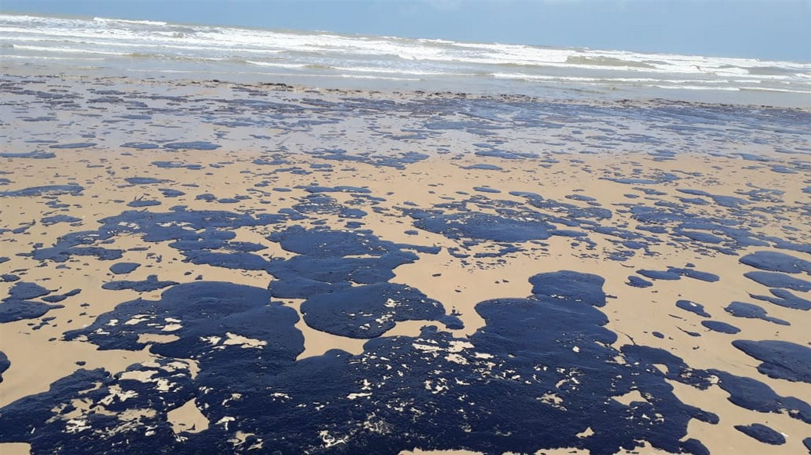
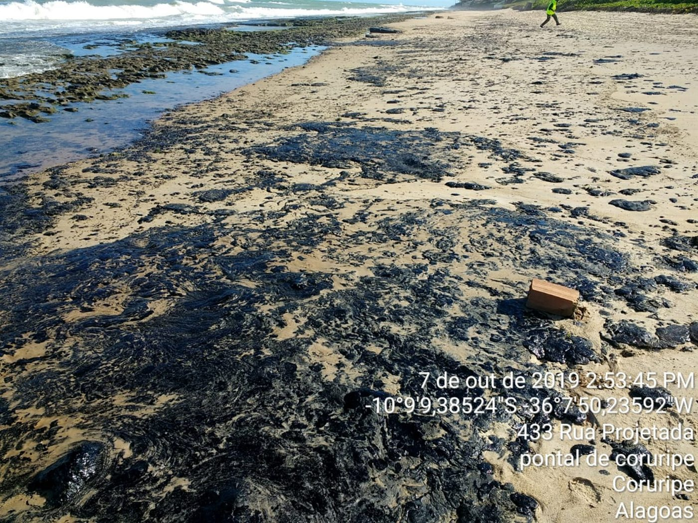
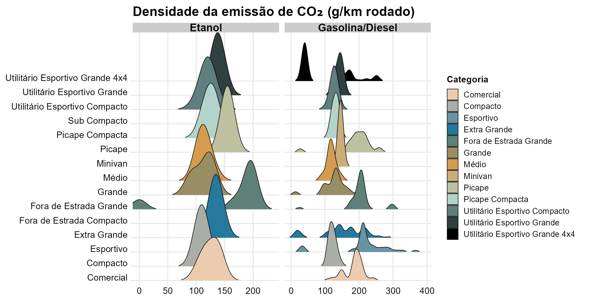
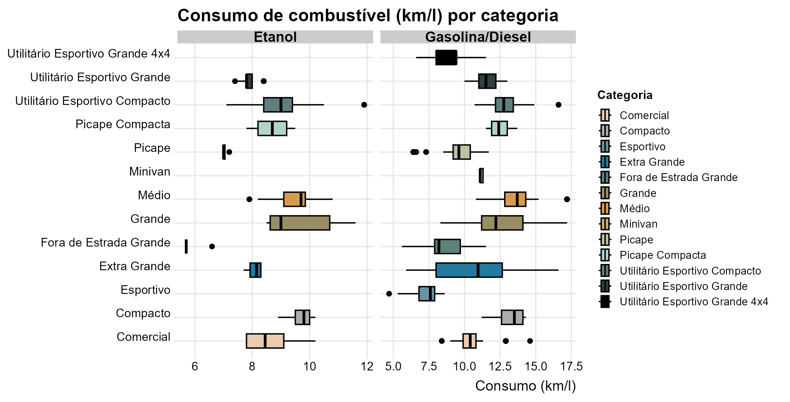
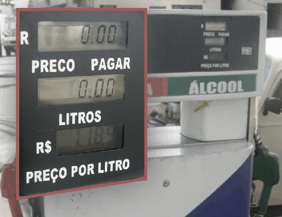

```{r}
#| label: setup
#| include: false

library(tidyverse)
library(gt)

pbev <- readRDS("pbev.rds") |>
  filter(emissao_gasolina_diesel_co2_total_g_km < 1000)

emissao_anual <- pbev |>
  group_by(categoria) |>
  summarise(
    Etanol = mean(emissao_etanol_co2_total_g_km, na.rm = TRUE) * 13000 / 1000,
    Gasolina_ou_Diesel = mean(emissao_gasolina_diesel_co2_total_g_km, na.rm = TRUE) * 13000 / 1000
  ) |>
  mutate(
    CO2_Evitado_Usando_Etanol = Gasolina_ou_Diesel - Etanol
  )
```

## O desafio dos combustíveis fósseis {.smaller}

::::: columns
::: {.column width="48%"}
A emissão de poluentes por **veículos a combustão** é um dos grandes desafios da modernidade, sobretudo nos **centros urbanos**.

Principais impactos:

- Poluição do ar e **gases de efeito estufa**
- Chuvas ácidas
- **Vazamentos de óleo e petróleo** que contaminam mares e oceanos

Bem evidenciado no relatório [Do Berço ao Túmulo: o impacto dos combustíveis fósseis na saúde](https://climateandhealthalliance.org/wp-content/uploads/2025/09/C2G-Report-low-res-Portuguese.pdf), da Global Climate & Health Alliance.
:::

::: {.column width="52%"}
{.framed style="height:230px; width:100%; object-fit:cover;"}

{.framed style="height:230px; width:100%; object-fit:cover;"}
:::
:::::

## 40 anos de Proconve: avanços reais {.smaller}

O **Proconve** (1986) reduziu drasticamente a emissão de monóxido de carbono (CO) por km rodado.

::::: columns
::: {.column width="33%"}
::: {.stat-box}
[54 → 0,4]{.big}
[g/km de CO por veículo]{.lbl}
:::
:::

::: {.column width="33%"}
::: {.stat-box}
[−98%]{.big}
[emissão de CO por veículo]{.lbl}
:::
:::

::: {.column width="33%"}
::: {.stat-box .green}
[−92%]{.big}
[emissão total da frota nacional]{.lbl}
:::
:::
:::::

O catalisador converte o **CO (tóxico)** em **CO₂** — poluente, mas não tóxico da mesma forma. A adesão ao **etanol** é mais um passo nessa trajetória de melhoria.

## A base de dados: PBEV 2026

::::: columns
::: {.column width="58%"}
**Fonte:** PBEV — Programa Brasileiro de Etiquetagem Veicular, mantido pelo **INMETRO** em parceria com o **IBAMA**.

**Como é coletada:** ensaios laboratoriais padronizados (ciclos de cidade e estrada), feitos pelas montadoras e fiscalizados pelo INMETRO; divulgados em formato aberto.

**Observações:** versões de veículos leves novos comercializados no Brasil (veículos elétricos não foram considerados).
:::

::: {.column width="42%"}
**Variáveis analisadas**

- **Categoria** do veículo
- **Emissão de CO₂** (g/km) — etanol e gasolina/diesel
- **Consumo combinado** (km/l) — etanol e gasolina/diesel
:::
:::::

## Perguntas de pesquisa

**População-alvo:** versões de veículos leves novos etiquetados pelo PBEV 2026.

1. O **etanol** emite menos **CO₂ por km** que a gasolina/diesel? Em quais categorias a diferença é maior?
2. Como se compara o **consumo (km/l)** do etanol ao da gasolina/diesel?
3. Quanto **CO₂, em média, seria evitado por ano** ao usar etanol, em cada categoria?

## Distribuição das emissões de CO₂ {.smaller}

*Objetivo: estudar a **frequência** das emissões de CO₂ por categoria, separando etanol de gasolina/diesel.*

{.framed fig-align="center" width="82%"}

> Na maioria das categorias, a gasolina/diesel se concentra em **patamares mais altos** → o etanol tende a **poluir menos por km**.

## Consumo de combustível por categoria {.smaller}

*Objetivo: comparar o **consumo (km/l)** entre categorias (mín. 3 veículos; valores ausentes removidos).*

{.framed fig-align="center" width="82%"}

> Etanol ~**5,7 a 11,9 km/l** · Gasolina/diesel ~**4,7 a 17,2 km/l** → com etanol percorre-se **menos km por litro**.

## Etanol: combustível renovável {.smaller}

::::: columns
::: {.column width="55%"}
O **etanol** é um biocombustível de matéria-prima vegetal, produzido pela fermentação de açúcares.

- **Renovável** — ao contrário dos fósseis, que são finitos
- Produção emite até **80% menos** poluentes que gasolina e diesel
- Une **energia limpa** à capacidade produtiva brasileira

> A vantagem ambiental por km convive com um **consumo maior** de combustível — um ponto de atenção.
:::

::: {.column width="45%"}
{.framed width="85%"}
:::
:::::

## Emissão média anual de CO₂ por categoria {.smaller .scrollable}

*Objetivo: **quantificar** a emissão média anual e o **CO₂ evitado** com etanol (médias por categoria, base de 13.000 km/ano).*

```{r}
#| label: tabela-gt
#| echo: false

emissao_anual |>
  gt() |>
  tab_header(
    title = "Emissão média de CO₂ por categoria veicular",
    subtitle = "Médias estimadas em kg de CO₂ por ano (13.000 km rodados)"
  ) |>
  cols_label(
    categoria                 = "Categoria",
    Etanol                    = "Etanol (kg/ano)",
    Gasolina_ou_Diesel        = "Gasolina/diesel (kg/ano)",
    CO2_Evitado_Usando_Etanol = "CO₂ evitado com etanol (kg/ano)"
  ) |>
  fmt_number(
    columns = where(is.numeric),
    decimals = 1,
    dec_mark = ",",
    sep_mark = "."
  ) |>
  sub_missing(
    columns = everything(),
    missing_text = "-"
  ) |>
  data_color(
    columns = c(Etanol, Gasolina_ou_Diesel),
    palette = "Reds"
  ) |>
  data_color(
    columns = CO2_Evitado_Usando_Etanol,
    palette = c("#e5f5e0", "#a1d99b", "#31a354")
  ) |>
  tab_source_note(
    source_note = "Fonte: INMETRO — Programa Brasileiro de Etiquetagem Veicular (PBEV 2026)."
  ) |>
  tab_options(
    table.font.size       = px(20),
    data_row.padding      = px(3),
    column_labels.padding = px(3),
    heading.padding       = px(3),
    table.width           = pct(90)
  )
```

> Em **todas** as categorias com etanol, o CO₂ evitado é **positivo**. Maiores ganhos: **Comercial** (~770 kg), **Fora de Estrada Grande** (~529) e **Picape** (~517); menores: **Utilitário Esportivo Grande** (~44) e **Médio** (~67).

## Conclusões {.smaller}

- O **etanol emite, em média, menos CO₂ por km** que gasolina e diesel em **todas** as categorias analisadas.
- Os **maiores ganhos ambientais** estão nas categorias mais pesadas (comerciais e picapes).
- Em contrapartida, o **rendimento (km/l) do etanol é menor** — a vantagem ambiental por km precisa ser avaliada junto ao maior volume de combustível consumido.

## Desafios {.smaller}

- Grande quantidade de **valores ausentes** na emissão do etanol: **393 das 639 versões** não têm o dado (por não serem flex/etanol).
- Presença de **categorias com poucos veículos**, o que limita comparações estatísticas mais robustas.

## Uso de inteligência artificial {.smaller}

Foi utilizada a ferramenta **Claude (Opus 4.8)** para:

- correção da sintaxe e organização/disposição do texto;
- dispor os gráficos de *density ridges* e *boxplot* lado a lado mantendo a interatividade (**ggiraph**);
- ajustar o posicionamento dos elementos.

## Referências principais {.smaller}

::: {.refs}
- INMETRO. **Programa Brasileiro de Etiquetagem Veicular (PBEV 2026)** — dados abertos.
- IBAMA. *Pioneiro na América Latina, programa de controle da poluição veicular completa 40 anos.*
- GLOBAL CLIMATE & HEALTH ALLIANCE. *Do Berço ao Túmulo: o impacto dos combustíveis fósseis na saúde* (2ª ed.).
- RAÍZEN. *Etanol.* · CETESB. *Emissão veicular / Proconve.* · ANFAVEA. *O que é o Proconve.*

A lista completa de referências está disponível no relatório técnico.
:::

## {background-image="images/oleo_litoral2.jpg" background-opacity="0.30" background-color="#2B2423"}

::: {style="text-align:center; color:#FBF8F4; margin-top:1.2em;"}
[Obrigado!]{style="font-size:2.2em; font-weight:700;"}

[O etanol emite, em média, **menos CO₂ por km** em todas as categorias analisadas.]{style="display:block; font-size:0.95em; margin-top:0.4em;"}

[Leonardo Carletto · EDA do PBEV 2026]{style="display:block; color:#E1955F; font-size:0.85em; margin-top:0.6em;"}
:::
