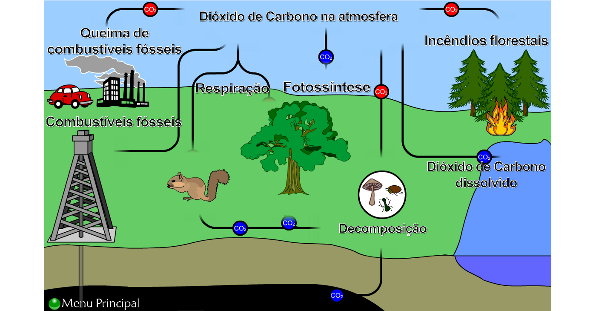

```{r}
#| label: setup
#| include: false

library(tidyverse)
library(gt)

pbev <- readRDS("pbev.rds") |>
  filter(emissao_gasolina_diesel_co2_total_g_km < 1000)

emissao_anual <- pbev |>
  group_by(categoria) |>
  summarise(
    Etanol                    = mean(emissao_etanol_co2_total_g_km, na.rm = TRUE) * 13000 / 1000,
    Etanol_Fossil             = mean(emissao_etanol_co2_fossil_total_g_km, na.rm = TRUE) * 13000 / 1000,
    Gasolina_ou_Diesel        = mean(emissao_gasolina_diesel_co2_total_g_km, na.rm = TRUE) * 13000 / 1000,
    Gasolina_ou_Diesel_Fossil = mean(emissao_gasolina_diesel_co2_fossil_total_g_km, na.rm = TRUE) * 13000 / 1000
  ) |>
  mutate(CO2_Evitado_Usando_Etanol = Gasolina_ou_Diesel - Etanol)
```

## O desafio dos combustíveis fósseis {.smaller}

::::: columns
::: {.column width="50%"}
A emissão de poluentes por **veículos a combustão** é um dos grandes desafios da modernidade, sobretudo nos **centros urbanos**.

Principais impactos:

- Poluição do ar e **gases de efeito estufa**
- Chuvas ácidas
- **Vazamentos de óleo e petróleo** que contaminam mares e oceanos

Esses impactos são evidenciados no relatório [*Do Berço ao Túmulo: o impacto dos combustíveis fósseis na saúde*](https://climateandhealthalliance.org/wp-content/uploads/2025/09/C2G-Report-low-res-Portuguese.pdf), da [Global Climate & Health Alliance](https://climateandhealthalliance.org/).
:::

::: {.column width="50%"}
{.framed width="100%"}
:::
:::::

## 40 anos de Proconve: avanços reais {.smaller}

O [**Proconve**](https://www.gov.br/ibama/pt-br/assuntos/emissoes-e-residuos/emissoes/programa-de-controle-de-emissoes-veiculares-proconve) (1986) reduziu drasticamente a emissão de **monóxido de carbono (CO)** por km rodado.

::::: columns
::: {.column width="33%"}
::: {.stat}
[54 → 0,4]{.big}
[g/km de CO por veículo]{.lbl}
:::
:::
::: {.column width="33%"}
::: {.stat}
[−98%]{.big}
[emissão de CO por veículo]{.lbl}
:::
:::
::: {.column width="33%"}
::: {.stat .green}
[−92%]{.big}
[emissão total da frota nacional]{.lbl}
:::
:::
:::::

O catalisador converte o **CO (tóxico)** em **CO₂** — poluente, mas não tóxico da mesma forma. A adesão ao **etanol** é mais um passo nessa trajetória de melhoria.

## A base de dados: PBEV 2026 {.smaller}

::::: columns
::: {.column width="56%"}
**Fonte:** [PBEV — Programa Brasileiro de Etiquetagem Veicular](https://www.gov.br/inmetro/pt-br/assuntos/avaliacao-da-conformidade/programa-brasileiro-de-etiquetagem/tabelas-de-eficiencia-energetica/veiculos-automotivos-pbe-veicular), mantido pelo [**INMETRO**](https://www.gov.br/inmetro/pt-br) em parceria com o [IBAMA](https://www.ibama.gov.br/index.php).

**Como é coletada:** ensaios laboratoriais padronizados (ciclos de cidade e estrada), feitos pelas montadoras e fiscalizados pelo INMETRO; divulgados em formato aberto.

**Observação:** versões de veículos leves novos (elétricos não foram considerados).
:::

::: {.column width="44%"}
**Variáveis analisadas**

- **Categoria** do veículo
- **Emissão de CO₂** (g/km) — etanol e gasolina/diesel
- **Emissão de CO₂ fóssil** (g/km) — etanol e gasolina/diesel
- **Consumo combinado** (km/l) — etanol e gasolina/diesel
:::
:::::

## Objetivo e perguntas de pesquisa {.smaller}

> Investigar como o uso do **etanol** pode impactar a diminuição da poluição em comparação aos combustíveis fósseis (gasolina e diesel), **quantificar** os impactos anuais de emissão por categoria e **medir** o consumo por km, por tipo de combustível.

1. O **etanol** emite menos **CO₂ por km** que a gasolina/diesel? Em quais categorias a diferença é maior?
2. Como se compara o **consumo (km/l)** do etanol ao da gasolina/diesel?
3. Quanto **CO₂, em média, seria evitado por ano** ao usar etanol, em cada categoria?

## Distribuição das emissões de CO₂ {.smaller}

*Objetivo: estudar a **frequência** das emissões de CO₂ por categoria, separando etanol de gasolina/diesel.*

{.framed fig-align="center" width="80%"}

> Na maioria das categorias, a gasolina/diesel se concentra em **patamares mais altos** → o etanol tende a **poluir menos por km**.

## Consumo de combustível por categoria {.smaller}

*Objetivo: comparar o **consumo (km/l)** entre categorias (mín. 3 veículos; ausentes removidos).*

{.framed fig-align="center" width="80%"}

> Etanol ~**5,7 a 11,9 km/l** · Gasolina/diesel ~**4,7 a 17,2 km/l** → com etanol percorre-se **menos km por litro**.

## Etanol: combustível renovável {.smaller}

::::: columns
::: {.column width="58%"}
O **etanol** é um biocombustível de **matéria-prima vegetal**, produzido pela fermentação de açúcares.

- **Renovável** — ao contrário dos fósseis, que são finitos
- Produção emite até **80% menos** poluentes que gasolina e diesel
- A gasolina brasileira já é **E30** (≈30% de etanol)

> A vantagem ambiental por km convive com um **consumo maior** de combustível — um ponto de atenção.
:::

::: {.column width="42%"}
{.framed width="100%"}
:::
:::::

## Emissão média anual de CO₂ por categoria {.smaller .scrollable}

*Médias por categoria, em kg de CO₂/ano (base de 13.000 km). **Total** inclui a parcela biogênica; **fóssil** é só a parcela de origem fóssil.*

```{r}
#| label: tabela-gt
#| echo: false

emissao_anual |>
  gt() |>
  tab_header(
    title = "Emissão média de CO₂ por categoria veicular",
    subtitle = "Médias estimadas em kg de CO₂ por ano (13.000 km rodados)"
  ) |>
  cols_label(
    categoria                 = "Categoria",
    Etanol                    = "Total (kg/ano)",
    Etanol_Fossil             = "Fóssil (kg/ano)",
    Gasolina_ou_Diesel        = "Total (kg/ano)",
    Gasolina_ou_Diesel_Fossil = "Fóssil (kg/ano)",
    CO2_Evitado_Usando_Etanol = "CO₂ evitado com etanol (kg/ano)"
  ) |>
  tab_spanner(label = "Etanol", id = "sp_etanol",
              columns = c(Etanol, Etanol_Fossil)) |>
  tab_spanner(label = "Gasolina/Diesel", id = "sp_gasdiesel",
              columns = c(Gasolina_ou_Diesel, Gasolina_ou_Diesel_Fossil)) |>
  fmt_number(columns = where(is.numeric), decimals = 1,
             dec_mark = ",", sep_mark = ".") |>
  sub_missing(columns = everything(), missing_text = "-") |>
  data_color(columns = c(Etanol, Gasolina_ou_Diesel), palette = "Reds") |>
  data_color(columns = c(Etanol_Fossil, Gasolina_ou_Diesel_Fossil), palette = "Purples") |>
  data_color(columns = CO2_Evitado_Usando_Etanol,
             palette = c("#e5f5e0", "#a1d99b", "#31a354")) |>
  tab_source_note("CO₂ total inclui a parcela biogênica; CO₂ fóssil é só a de origem fóssil. O etanol tem fóssil ≈ 0; a gasolina E30 já desconta os ~30% de etanol.") |>
  tab_source_note("Fonte: INMETRO — Programa Brasileiro de Etiquetagem Veicular (PBEV 2026).") |>
  tab_options(table.font.size = px(15), data_row.padding = px(2),
              column_labels.padding = px(2), heading.padding = px(2),
              table.width = pct(100))
```

> Em **todas** as categorias com etanol, o CO₂ evitado é **positivo**. Maiores ganhos: **Comercial** (~770 kg), **Fora de Estrada Grande** (~529) e **Picape** (~517). Na base **fóssil**, as diferenças são ainda maiores — o etanol emite **≈ 0** de CO₂ fóssil.

## Conclusões {.smaller}

- O **etanol emite, em média, menos CO₂ por km** que gasolina e diesel em **todas** as categorias analisadas.
- Por ser **renovável**, praticamente **não emite CO₂ "novo"** (fóssil) na atmosfera.
- Os **maiores ganhos ambientais** estão nas categorias mais pesadas (comerciais e picapes).
- Em contrapartida, o **rendimento (km/l) do etanol é menor** — a vantagem por km precisa ser avaliada junto ao maior volume consumido.

## Desafios e próximos passos {.smaller}

- Grande quantidade de **valores ausentes** na emissão do etanol: **393 das 639 versões** não têm o dado (por não serem flex/etanol).
- **Categorias com poucos veículos**, o que limita comparações estatísticas mais robustas.
- **Futuras análises:** incluir o **custo por km** de cada categoria e a comparação **ano a ano** das emissões fósseis, para avaliar o efeito das regulamentações.

## Uso de inteligência artificial {.smaller}

Foi utilizada a ferramenta **Claude (Opus 4.8)** para:

- correção da sintaxe e organização/disposição do texto;
- dispor os gráficos de *density ridges* e *boxplot* lado a lado mantendo a interatividade (**ggiraph**);
- ajustar o posicionamento dos elementos.

## Referências principais {.smaller}

::: {.refs}
- INMETRO. [**Programa Brasileiro de Etiquetagem Veicular (PBEV 2026)**](https://www.gov.br/inmetro/pt-br/assuntos/avaliacao-da-conformidade/programa-brasileiro-de-etiquetagem/tabelas-de-eficiencia-energetica/veiculos-automotivos-pbe-veicular) — dados abertos.
- IBAMA. [*Pioneiro na América Latina, programa de controle da poluição veicular completa 40 anos*](https://www.gov.br/ibama/pt-br/assuntos/noticias/2026/pioneiro-na-america-latina-programa-de-controle-da-poluicao-veicular-completa-40-anos).
- GLOBAL CLIMATE & HEALTH ALLIANCE. [*Do Berço ao Túmulo: o impacto dos combustíveis fósseis na saúde*](https://climateandhealthalliance.org/).
- NASA. [*Climate Change*](https://science.nasa.gov/climate-change/) · [*Earth Indicators*](https://science.nasa.gov/earth/explore/earth-indicators/) · [*Carbon Dioxide*](https://science.nasa.gov/earth/explore/earth-indicators/carbon-dioxide/) · [*Emissions from Fossil Fuels Continue to Rise*](https://science.nasa.gov/earth/earth-observatory/emissions-from-fossil-fuels-continue-to-rise-152519/).
- BIO-DiTRL / [CASA DAS CIÊNCIAS. *Ciclo do Carbono*](https://www.casadasciencias.org/recurso/5878). · [RAÍZEN. *Etanol*](https://www.raizen.com.br/blog/etanol).

A lista completa de referências está no relatório técnico.
:::

## {background-color="#2B2423"}

::: {style="text-align:center; color:#FBF8F4; margin-top:1.2em;"}
[Obrigado!]{style="font-size:2.2em; font-weight:700;"}

[O etanol emite, em média, **menos CO₂ por km** — e praticamente **nada de CO₂ fóssil** — em todas as categorias analisadas.]{style="display:block; font-size:0.95em; margin-top:0.4em;"}

[Leonardo Carletto · EDA do PBEV 2026 · INMETRO]{style="display:block; color:#E1955F; font-size:0.85em; margin-top:0.6em;"}
:::
